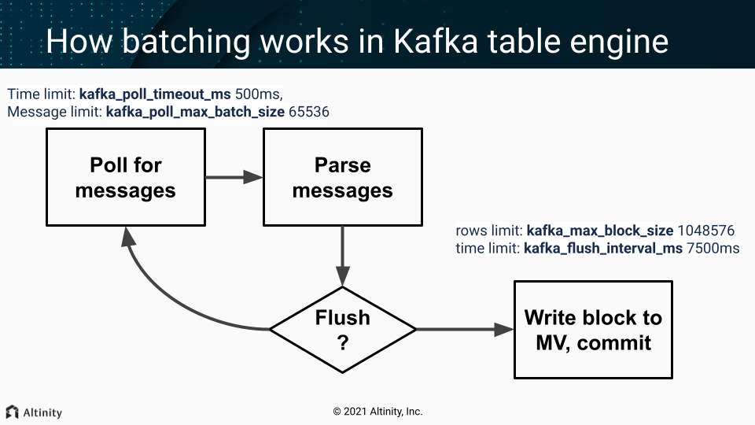

# Kafka main parsing loop

One of the threads from scheduled\_pool \(pre 20.9\) / `background_message_broker_schedule_pool` \(after 20.9\) do that in infinite loop:

1. Batch poll \(time limit: `kafka_poll_timeout_ms` 500ms, messages limit: `kafka_poll_max_batch_size` 65536\)
2. Parse messages.
3. If we don't have enough data \(rows limit: `kafka_max_block_size` 1048576\) or time limit reached \(`kafka_flush_interval_ms` 7500ms\) - continue polling \(goto p.1\)
4. Write a collected block of data to MV
5. Do commit \(commit after write = at-least-once\).

On any error, during that process, Kafka client is restarted \(leading to rebalancing - leave the group and get back in few seconds\).

## Important settings 

These usually should not be adjusted:

* `kafka_poll_max_batch_size` = max\_block\_size \(65536\)
* `kafka_poll_timeout_ms` = stream\_poll\_timeout\_ms \(500ms\)

You may want to adjust those depending on your scenario:

* `kafka_flush_interval_ms` = stream\_poll\_timeout\_ms \(7500ms\)
* `kafka_max_block_size` = min\_insert\_block\_size / kafka\_num\_consumers \(for the single consumer: 1048576\)

## See also 

[https://github.com/ClickHouse/ClickHouse/pull/11388](https://github.com/ClickHouse/ClickHouse/pull/11388)

© 2021 Altinity Inc. All rights reserved.
