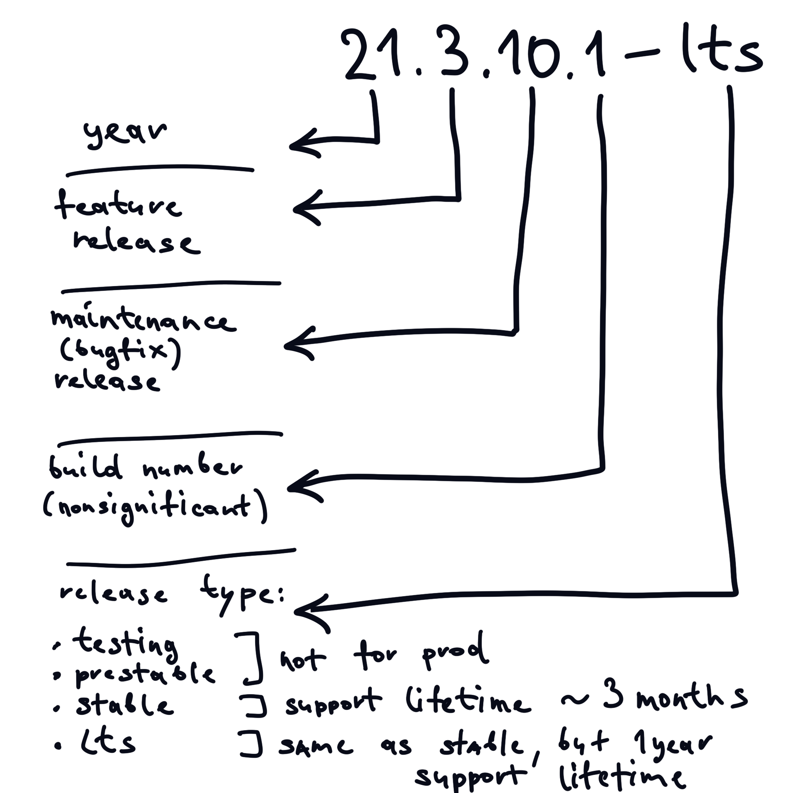

# ClickHouse versions

## ClickHouse versioning schema

Example: 

21.3.10.1-lts

1. 21 is the year of release.
2. 3 indicates a Feature Release. This is an increment where features are delivered.
3. 10 is the bugfix / maintenance version. When that version is incremented it means that some bugs was fixed comparing to 21.3.9. 
4. 1 - build number, means nothing for end users.
5. lts - type of release. \(long time support\).

### What is Altinity Stable version?

It is one of general / public version of ClickHouse which has passed some extra testings, the upgrade path and changelog was analyzed, known issues are documented, and at least few big companies use it on production. All those things take some time, so usually that means that Altinity Stable is always a  'behind' the main realeses.

Altinity version - is an option for conservative users, who prefer bit older but better known things.

Usually there is no reason to use version older than Altinity Stable. If you see that new Altinity Version arrived and you still use some older version - you should for sure consider an upgrade. 

Additionally for Altinity client we provide extra support for those version for a longer time \(and we also support newer versions\).

### Which version to pick: best practices

We recommend the following approach:

1. When you start using ClickHouse and before you go on production - pick the latest stable version.
2. If you already have ClickHouse running on production:
   1. Check all the new queries / schemas on the staging first, especially if some new ClickHouse features are used.
   2. Check latest stable or test versions of ClickHouse on your staging environment regularly and pass the feedback to us or on the [official ClickHouse github](https://github.com/ClickHouse/ClickHouse).
   3. Do minor \(bugfix\) upgrades regularly: monitor new maintenance releases of the feature release you use. 
   4. When considering upgrade - if you go to Altinity Stable release - check [Altinity Stable release docs](https://docs.altinity.com/altinitystablerelease/), if you want to use newer release - or analyze changelog and known issues there. 
   5. Consider blue/green or canary upgrades. 

## Bugs?.. 

ClickHouse development process goes in a very high pace and has already thousands of features. CI system doing tens of thousands of tests \(including tests with different sanitizers\) against every commit. 

All core features are well-tested, and very stable, and code is high-quality. But as with any other software bad things may happen. Usually the most of bugs happens in the new, freshly added functionality, and in some complex combination of several features \(of course all possible combinations of features just physically can’t be tested\). Usually new features are adopted by the community and stabilize quickly.

### What to do if I found a bug in clickhouse? 

1. First of all: try to upgrade to the latest bugfix release  Example: if you use v21.3.5.42-lts but you know that v21.3.10.1-lts already exists - start with upgrade to that. Upgrades to latest maintenance releases are smooth and safe. 
2. Look for similar issues in github. Maybe fix is on the way.
3. If you can reproduce the bug: try to isolate it - remove some pieces of query one-by-one / simplify the scenario until the issue still reproduces. This way you can figure out which part is responsible for that bug, and you can try to create [minimal reproducible example](https://stackoverflow.com/help/minimal-reproducible-example) 
4. Once you have minimal reproducible example: 
   1. report it to github \(or to Altinity Support\)
   2. check if it reproduces on newer clickhouse versions

