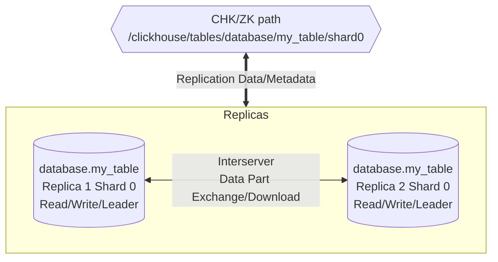
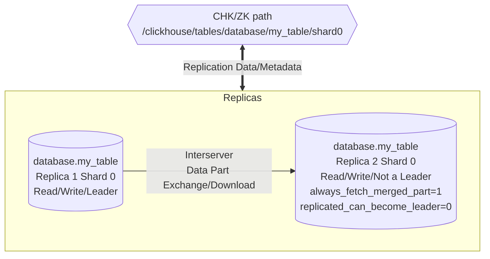

# Altinity.Cloud&reg; - Separation of Read and Write Workload Setup for ClickHouse&reg;

_Altinity®, Altinity.Cloud®, and Altinity Stable® are registered trademarks of Altinity, Inc. ClickHouse® is a registered trademark of ClickHouse, Inc.; Altinity is not affiliated with or associated with ClickHouse, Inc._

_This is a work in progress, changes may be introduced overtime._


## Goals

Explore 2 options to separate write and read workloads: 

* Single cluster with read/write split on each shard (at least 2 replicas per shard)

* Cross-replication with 2 clusters

This is possible by leveraging  Replicated MergeTree, Distributed table engines and macro processing features to split read and write workloads. One warning: this solution don't work if your pipeline relies on mutations - these can't be disabled, and they will run in parallel on all replicas (a `DELETE`or `UPDATE` mutation will impact the one or more replica sets).  


## Concepts

### Macro Processing

Macros, in ClickHouse, are a convenient way to define constant values which can be used in some places. A macro is simply a name mapped to a value, defined in `<macros>` configuration section, and visible in `system.macros` system table. 

```xml
<clickhouse>
	<macros>
    	<cluster>all-replicated</cluster>
        <replica>replica-1</replica>
        <custom_value>1</custom_value>
    </macros>
</clickhouse>
```

A macro can be expanded if refered as `{macro_name}` - for example, `ALTER TABLE table_name ON CLUSTER '{cluster}'` gets the `cluster` macro name and replace `{cluster}` with it. These values can also be configured to get the value from the environment: 

```xml
<clickhouse>
	<macros>
    	<cluster from_env="CLUSTER"/>
        <replica from_env="REPLICA"/>
        <custom_value>1</custom_value>
    </macros>
</clickhouse>
```

Macros provide enough flexibility to create configuration templates, which will have appropriate values on each node - some of those macros are configured with unique values on nodes by the Altinity&reg; Operator for ClickHouse&reg;. 


### MergeTree Replication Basics

A shard can be described as a replica set - a unit where each table is a replica, and in ClickHouse, eventually consistent in time. Replication is implemented at table level by the MergeTree family, which provides single and replicated versions of each engine (with the replicated version prefixed with `Replicated`, for example, `ReplacingMergeTree` is not replicated, but `ReplicatedReplacingMergeTree` is).


Some properties are:

* Shared-nothing architecture: each replica resides on a node, with a full copy of data and metadata (where some settings can be different across nodes, like storage policy)
* Replication is coordinated using a per-shard location in ClickHouse Keeper/ZooKeeper (each shard is a replica set, independent from other shards), storing the table metadata (for consistency checks), replica information (they know each other), data parts and replication event log. This path (_zk_path_ for short) is also what identifies a replicated table (table names on nodes can be different - it is not practical nor recommended, but it is possible - if they have the same zk_path, they are _the same table_)
* Replicas are, by default, leaders - a leader in replicated MergeTree means that replica can schedule background merges
* Mutations are a special case: they can modify data or metadata, and will always run on all replicas. 

A common usage looks like:



To split read and write workloads, assume that: 

* A read replica only serves read-queries (`SELECT ..`) - to minimize I/O and CPU usage with other tasks, these require adjustment of 2 settings: `replicated_can_become_leader` set to 0 (defaults to 1) and `always_fetch_merged_part` set to 1 (defaults to 0). This can be accomplished in 2 ways:

  * Global Replicated MergeTree settings: no metadata changes are necessary, all replicas will share the same configuration
  * Per replica settings: adjustment of settings done at replica level via `ALTER TABLE .. MODIFY SETTING`

* A write replica will receive new data, schedule and run merges - the default settings are appropriate for this workload. 

* Low usage of mutations to avoid spawning long running read/write load across nodes - they are always replicated, and will trigger merges on all replicas; some operations can't be avoided and may cause a read/write load on replicas - replicated DDL operations like materializing an index or a column, for example.

* The terminology used here is not a complete description of how each replica will behave: the so called _read replicas_ are not read only (they will accept inserts), for example. Worst-case scenario, all replicas can be used for inserts and selects (but if a _write replica_ is not running, merges won't run and ingestion may halt due to a TOO_MANY_PARTS exception). 



### Distributed Operations

ClickHouse provide features to operate as a distributed database - table replication is a part of the machinery, but on its own, it does not provide an interface to run distributed queries (some DDL are replicated at shard level, nothing more). To achieve that, a few mechanisms are provided: 

* `Distributed DDL`: tasks such as create or drop a table can be executed to a set of nodes
* `Distributed Table Engine`: provides functionality to ingest and shard data, as well act as a client to run a distributed select queries
* `Distributed Table Function`: `cluster` (similar functionality to Distributed table engine) and `clusterAllReplicas` (to run a query on all shards/replicas described by a cluster) 

Both mechanisms relies on a concept of a _cluster_: a defined set of nodes where the operations will be scheduled and executed. A _cluster_ in ClickHouse is defined in the configuration section `remote_servers`, with each cluster definition providing a layout describing each shard with its replicas. 

```xml
<!-- remote_servers configuration example //-->
<clickhouse>
    <!-- Single shard layout //-->
	<all-replicated>
    	<shard>
            <internal_replication>true</internal_replication>
        	<replica>
            	<host>replica-1</host>
                <port>9000</port>
            </replica>
            <replica>
            	<host>replica-2</host>
                <port>9000</port>
            </replica>
        </shard>
    </all-replicated>
    <!-- One shard per node //-->
    <all-sharded>
    	<shard>
        	<replica>
            	<host>replica-1</host>
                <port>9000</port>
            </replica>
        </shard>
        <shard>
            <replica>
            	<host>replica-2</host>
                <port>9000</port>
            </replica>
        </shard>
    </all-sharded>
</clickhouse>
```

How these clusters are used depends on the mechanism we are talking about: 

* For Distributed DDL: Data Definition Language run with `ON CLUSTER cluster_name` will be built on the initiator, enumerating all the replicas of `cluster_name` and writing the task into ClickHouse Keeper/ZooKeeper (configuration section `distributed_ddl`), then picked up by a special process (`DDLWorker`) and executed on each replica (even the initiator)
* For Distributed table: by default, inserts will be sharded (according to the sharding key of the table), stored on disk for each shard, and sent to replicas (one per shard if `internal_replication` is true, to all replicas if it is set to false); selects will be parsed and sent to one replica per shard, where they are executed, data is sent back to the initiator to be finalized before being sent back to the client application.

Such configuration is also flexible - notice that both definitions include the same node (so, for replication/sharding, there is no concept of _node type_), so we can play with it to split read/write functionality if using `Distributed` tables (sharded environment). Expanding the example above to 4 nodes, let's have 2 nodes per shard and 2 new cluster definitions: 

```xml 
<!-- remote_servers configuration example //-->
<clickhouse>
    <!-- Single shard layout //-->
	<all-replicated>
    	<shard>
            <internal_replication>true</internal_replication>
        	<replica>
            	<host>replica-1</host>
                <port>9000</port>
            </replica>
            <replica>
            	<host>replica-2</host>
                <port>9000</port>
            </replica>
            <replica>
            	<host>replica-3</host>
                <port>9000</port>
            </replica>
            <replica>
            	<host>replica-4</host>
                <port>9000</port>
            </replica>
        </shard>
    </all-replicated>
    <!-- One shard per node //-->
    <all-sharded>
    	<shard>
        	<replica>
            	<host>replica-1</host>
                <port>9000</port>
            </replica>
        </shard>
        <shard>
            <replica>
            	<host>replica-2</host>
                <port>9000</port>
            </replica>
        </shard>
        <shard>
            <replica>
            	<host>replica-3</host>
                <port>9000</port>
            </replica>
		</shard>
        <shard>
            <replica>
            	<host>replica-4</host>
                <port>9000</port>
            </replica>
        </shard>
    </all-sharded>
    <!-- 2 shard, 2 replica layout //-->
    <sharded_cluster>
    	<shard>
            <internal_replication>true</internal_replication>
        	<replica>
            	<host>replica-1</host>
                <port>9000</port>
            </replica>
            <replica>
            	<host>replica-2</host>
                <port>9000</port>
            </replica>
        </shard>
        <shard>
            <internal_replication>true</internal_replication>
            <replica>
            	<host>replica-3</host>
                <port>9000</port>
            </replica>
            <replica>
            	<host>replica-4</host>
                <port>9000</port>
            </replica>
        </shard>
    </sharded_cluster>
    <!-- defining 2 shards, 1 replica for write operations //-->
    <write_cluster>
    	<shard>
        	<replica>
            	<host>replica-1</host>
                <port>9000</port>
            </replica>
        </shard>
        <shard>
            <replica>
            	<host>replica-3</host>
                <port>9000</port>
            </replica>
        </shard> 
    </write_cluster>
    <!-- defining 2 shards, 1 replica for read operations //-->
    <read_cluster>
    	<shard>
        	<replica>
            	<host>replica-2</host>
                <port>9000</port>
            </replica>
        </shard>
        <shard>
            <replica>
            	<host>replica-4</host>
                <port>9000</port>
            </replica>
        </shard> 
    </read_cluster>
</clickhouse>
```

In the above, `write_cluster` and `read_cluster` targets 2 nodes on each shard - using these on `Distributed` allows to send queries only to a subset of nodes of another cluster (`shared_cluster`) - this way, read/write split can be achieved by using `macro` processing  - defining a macro, like `distributed_cluster`, with value `write_cluster` on write nodes and `read_cluster` on read nodes will effectively make distributed tables created like `ENGINE=Distributed('{distributed_cluster}',...)` to send queries to the appropriate nodes.

## Single Cluster vs. Replica Cluster in Altinity.Cloud&reg;

Although ClickHouse&reg; Server provides enough flexibility, standardizing ways to configure and manage a cluster in a cloud environment may not allow all such features to be explored, as some of those may make some tasks either impossible or too hard to maintain, like scale up and down a cluster. 

With that in mind, let's consider the single cluster's scenario challenges to make it work: 

* Custom cluster definitions can be added to group write and read nodes, but every time the cluster is re-scaled, they have to be manually managed to reflect the changes
* Macros and remote servers configuration are managed by the operator - this is required as it manages operations like scale up and down (adding/removing replicas and shards). As Distributed tables relies on a cluster layout defined in remote servers, it is required to manually manage those tables on each replica of a shard (as each would have to point to a different cluster name) or creating 2 tables per shard (one for writing, one for reading), which can be confusing to users and hard to maintain
* Replicated MergeTree settings will require manual interaction - turning on both settings at cluster level will work, but on ingestion replicas these have to be turned off (or merges will never happen)
* As the load balancer can't know where to forward a request based on its type (read or write), either read or write nodes have to be taken out of the load balancer configuration manually in ACM UI, and read or write application have to implement the logic to pickup a host to work with; high availability capabilities may be compromised that way, specially in situations where a rolling restart is required (upgrade, configuration updates), leading to exceptions (which may not be desired on a user-facing application)

But some (small?) advantages: 

* Some table maintenance tasks are simplier - for replicated MergeTree tables, using the default cluster (`{cluster}`) for `ON CLUSTER` operations will keep consistency across nodes

* User management is simple, either with SQL RBAC or ACM UI user management

With all the above considered, the major caveat is manageability - as this approach is out of the standard pattern used by the management provided by ACM, too many pieces have to be considered and reconfigured for simple scaling operations, being too easy to have a node in or out of the load balancer and break functionality. 

Altinity.Cloud&reg; have a feature called `Replica Cluster` - it spins up a new cluster with a new name (so endpoints for connections are different than the source cluster), create the tables currently present and start replication; the `{cluster}` macro has the same value on both clusters, but they do not refers to all the nodes, so distributed operations run only on the cluster it is initiated (with one exception: some DDL are replicated, like add/drop a column, delete/update mutations). These clusters differs from common clusters because: 

* They share the same ClickHouse Keeper/ZooKeeper as the source cluster they have been launched from, so it is possible to expand the number of replicas of a table but localize operations (write on one cluster, read on the other)
* They must have the same layout as the source cluster (it is not possible to have a replica cluster with more or less shards than the source cluster)
* The value of the `{cluster}` macro is the same as the source cluster (clusters in ACM name the default cluster as the same as the name of the cluster in the UI, so, "mycluster" in ACM UI means `{cluster}` expands to `mycluster`)

The challenges with this approach are: 

* Metadata consistency: for `ON CLUSTER` CREATE/DROP (and other non-replicated DDL), they have to be executed on each cluster (for example, creating a table on `source-cluster` won't mean it will be created on `replica-cluster`), and some extra attention is needed as default replica paths may use information that is generated by the initiator node (table `uuid`, for example) and would be different when executed on the second cluster, thus not being in the same replica set
* Separation of workload type is done by endpoint name, so read and write application need to be pointed to the proper cluster endpoint (client side configuration)

On the other hand, what is challenging with a single cluster approach becomes easier to do with a replica cluster, with even some extras:

* Managing MergeTree options is simplified as it can be done at the cluster level (setting `replicated_can_become_leader` and `always_fetch_merged_part` can be done at table level too, but it is easier to maintain if done at the cluster level)
* As the `cluster` macro is the same, but its layout is managed accordingly by ACM, no special handing to create distributed tables is required (the same DDL on both clusters will work accordingly)
* Node sizes can differ on each cluster, on a single cluster they are the same for all ClickHouse instances
* Scaling up and down mechanics are not changed, nor require special attention, and is completely managed by the ACM; also, it is easier to revert it all to a read/write scenario (less configuration changes are required)

## Which approach to use? 

From the costs perspective, a replica cluster can be more effective - nodes can be scaled down when write volume is low, scaled up when needed (for backfills, or if ingestion rate increases), without compromising read applications (in a single cluster, all nodes are equal). 

From the management perspective, a replica cluster seems easier, as the boilerplate configurations are managed by ACM, with fewer items to be managed by the user (like migrations, as they have to run on both clusters, but most tools allows to run the same migration on different connections), thus less confusing and less prone to simple mistakes that can cost a few hours of work to fix the results.  With that in mind, launching a replica cluster is the way to go. 


## Altinity&reg; Cloud Replica Cluster - Setup Procedure

The overall procedure entails: 

* Launching a replica cluster in ACM UI
* Changing configuration on the read-cluster 


### Launching a Replica Cluster 

* Access the cluster you wish to create a replica cluster in ACM
* Locate the `Actions` button, click on `Launch Replica Cluster` to launch the wizard

* Name the new cluster - notice that, by default, `Replicate Schema` is checked - if not, check it to automatically create the whole schema in the new cluster; click `Next`

* Configure your resources - it is important to keep in mind that storage has to be enough to fit existing data in the source cluster (recommendation is to have the same storage size per node as the source cluster); click `Next`

* Configure High Availability options (recommendation is to use the same as the source cluster); click `Next`

* Configure Connection options - setup VPCs, endpoints as needed; click `Next`

* The next 2 screens are for Activity Schedule (defaults to Always On) and Annotations - for most cases no extra action is needed; click `Next`


* Review the configuration and, when finished, click `Launch`

* Wait for the new cluster to become online and wait until the data is replicated (check replication queue size and replication delays, verify table row counts after the queue goes down to check if they match the source)

### Configuring the Read Cluster 

* Go to the cluster chosen to be the Read Cluster, locate the button `Configuration` on top, click on it, locate and click on `Settings`

* Click on `Add Setting`

* In the popup window, check `Attribute` (if not checked), type `merge_tree/replicated_can_become_leader` in the `Name`, and 0 in the `Value` field. Click  `Ok`. 

* Click on `Add Setting` again - in the popup window, check `Attribute` (if not checked), type `merge_tree/always_fetch_merged_part` in the `Name` field, and 1 in the `Value` field. Click `Ok`. 

* Go back to the cluster page - notice there will be a warning about pending configuration changes. Click in `Publish` to review the configuration changes. 

* Review the changes and click `Confirm`

* Wait a few minutes for the settings to be in effect. 
